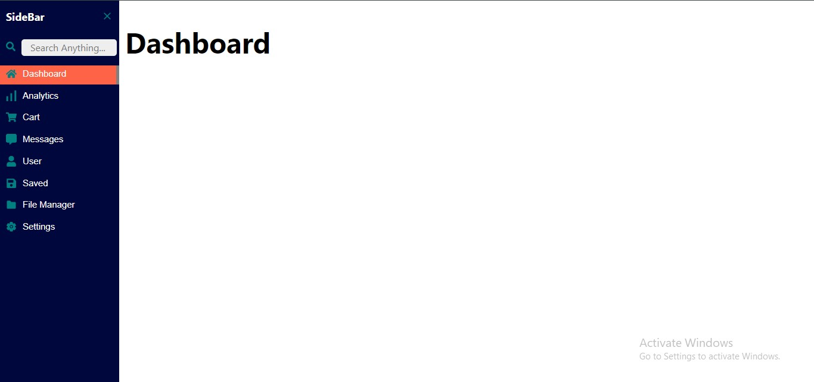
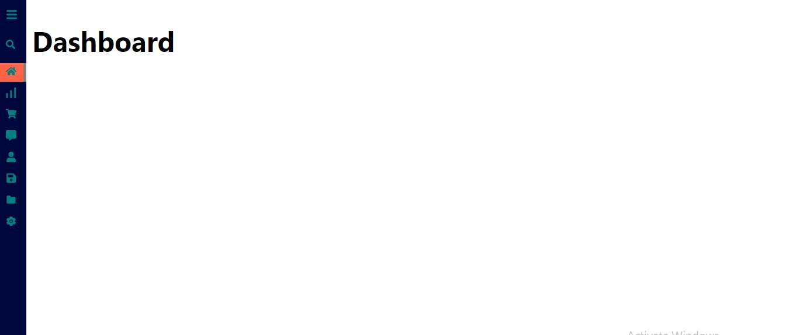

# Learning_FramerMotion


## Table of Contents

- [How to Start the App](#how-to-start-the-app)
- [Frontend](#frontend)
- [Screenshots](#screenshots)
  - [Home Page](#home-page)
- [Tech Stack](#tech-stack)

## How to Start the App

This is the Small MiniProject which Uses ReactJs and Framer Motion , for biulding Modern SideBar Navigation

## Frontend 

1. Clone the repository:

   ```bash
   git clone https://github.com/GaneshYadav3142/Hosteller_Assignment.git


2. Open the  terminal, move to **sidebar** directory:

   ```bash
   cd sidebar


3. Install Necessary Dependencies: 

    ```bash
   npm install

4. Start the Frontend server ,the app will run on port 3000,with http://localhost:3000:

    ```bash
    npm run start

## Screenshots

### Homepage 






## Tech Stack

The app is built using the following technologies:

Frontend
1. ReactJs
2. Framer Motion
3. HTML5
4. CSS3

